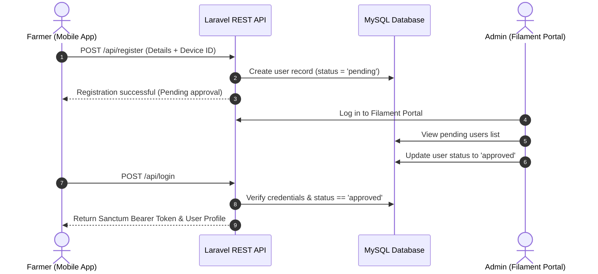

# SmartAgro: Intelligent IoT Greenhouse & Farm Automation System
## Complete End-to-End Technical Documentation & Master Project Description

---

## 1. Project Overview & Executive Summary

**SmartAgro** is an enterprise-grade, IoT-driven microclimate control, irrigation automation, and farm management platform designed for modern precision agriculture and greenhouse management. The system integrates hardware telemetry collection, automated relay switching, cloud-based RESTful API services, an administrative audit web portal, and a cross-platform mobile application for farmers.

### Core Objectives & Value Proposition
* **Microclimate Optimization:** Continuous monitoring of air temperature, relative humidity, and soil moisture to maintain ideal crop growth conditions.
* **Automated Actuation:** Dynamic control of high-voltage hardware components (Drip Pump, Mist Spray Pump, Exhaust Ventilation Fan, and Supplemental Grow Lights).
* **Dual Control Modes:** Dynamic toggling between threshold-based automated algorithms and user-driven manual remote overrides.
* **Subscription & Access Control:** Strict account verification and monthly subscription billing verification via proof-of-payment slip uploads audited by system administrators.
* **AI-Powered Agronimic Support:** Embedded AI assistant (powered by Google Gemini / OpenAI) providing instant crop health diagnosis, fertilizer schedules, and pest mitigation advice.
* **Real-Time Push Alert System:** Instant Firebase Cloud Messaging (FCM) push alerts triggered during critical threshold breaches (e.g., severe soil drought, overheating).

---

## 2. High-Level System Architecture

The overall platform consists of four interconnected layers:

1. **Embedded IoT Hardware Layer (ESP32):** Reads analog and digital sensor telemetry and triggers 4-channel relay modules.
2. **Cloud Backend REST API Layer (Laravel 11):** Processes business logic, time-series telemetry data storage, authentication tokens, and FCM push notifications.
3. **Admin Web Management Portal (Filament v3):** Provides superuser oversight for user approvals, billing slip reviews, telemetry analytics, and direct support chat.
4. **Mobile Application Layer (Flutter):** Enables farmers to monitor live microclimate metrics, set irrigation schedules, chat with AI agronomists, upload payment slips, and remotely override hardware actuators.

```mermaid
graph TD
    %% Hardware Layer
    subgraph Hardware_Layer [ESP32 Microcontroller Subsystem]
        ESP[ESP32 Controller]
        DHT[DHT22 Temp & Humidity Sensor]
        SOIL[Soil Moisture Sensor (Analog)]
        RELAY_DRIP[Drip Irrigation Relay]
        RELAY_MIST[Mist Spray Relay]
        RELAY_FAN[Exhaust Fan Relay]
        RELAY_LIGHT[Grow Light Relay]

        ESP --> DHT
        ESP --> SOIL
        ESP --> RELAY_DRIP
        ESP --> RELAY_MIST
        ESP --> RELAY_FAN
        ESP --> RELAY_LIGHT
    end

    %% Backend & Database Layer
    subgraph Cloud_Backend [Laravel 11 REST API & Admin Portal]
        API[Laravel REST API Controllers]
        DB[(MySQL Database)]
        FILAMENT[Filament v3 Admin Panel]
        FCM[Firebase Cloud Messaging API]

        API <=> DB
        FILAMENT <=> DB
        API --> FCM
    end

    %% Mobile Layer
    subgraph Mobile_App [Flutter Mobile Application]
        FLUTTER[Flutter Mobile UI Engine]
        AI[AI Agronomist Chatbot]
        SCANNER[QR Code Hardware Scanner]
        PAYMENTS[Subscription Billing Module]
        SCHEDULER[Irrigation Routine Manager]
    end

    %% Interactions
    ESP <=>|HTTP POST /api/esp32/sync| API
    FLUTTER <=>|HTTP REST API / Bearer Token| API
    FLUTTER <=>|Google Generative AI API| AI
    FCM -.->|Push Warning Notifications| FLUTTER
```

---

## 3. Database Architecture & Schema Specification

The application uses a **MySQL** relational database named `sm_agro`. Below is the complete specification of all 11 database tables, data types, key constraints, and operational purposes.

### 3.1 `users`
Stores farmer account information, hardware device assignments, approval states, and Firebase FCM tokens.

| Column Name | Data Type | Modifiers / Constraints | Description |
| :--- | :--- | :--- | :--- |
| `id` | BIGINT | PRIMARY KEY, AUTO_INCREMENT | Unique user identifier |
| `name` | VARCHAR(191) | NOT NULL | Full name of the user |
| `email` | VARCHAR(191) | UNIQUE, NOT NULL | Account login email |
| `password` | VARCHAR(191) | NOT NULL | Bcrypt-hashed password |
| `address` | VARCHAR(191) | NULLABLE | Physical farm or greenhouse location |
| `device_id` | VARCHAR(191) | NULLABLE | Assigned ESP32 hardware hardware serial ID |
| `status` | VARCHAR(191) | DEFAULT 'pending' | Authorization state (`pending`, `approved`, `denied`) |
| `fcm_token` | TEXT | NULLABLE | Device Firebase push notification token |
| `email_verified_at`| TIMESTAMP | NULLABLE | Timestamp of email validation |
| `remember_token` | VARCHAR(100) | NULLABLE | Auth session remember token |
| `created_at` | TIMESTAMP | DEFAULT CURRENT_TIMESTAMP | Record creation timestamp |
| `updated_at` | TIMESTAMP | DEFAULT CURRENT_TIMESTAMP | Record update timestamp |

---

### 3.2 `admins`
Stores web administrative superuser credentials for accessing the Filament admin panel.

| Column Name | Data Type | Modifiers / Constraints | Description |
| :--- | :--- | :--- | :--- |
| `id` | BIGINT | PRIMARY KEY, AUTO_INCREMENT | Admin unique ID |
| `name` | VARCHAR(191) | NOT NULL | Administrator name |
| `email` | VARCHAR(191) | UNIQUE, NOT NULL | Administrator login email |
| `password` | VARCHAR(191) | NOT NULL | Bcrypt-hashed password |
| `remember_token` | VARCHAR(100) | NULLABLE | Admin session remember token |
| `created_at` | TIMESTAMP | DEFAULT CURRENT_TIMESTAMP | Record creation timestamp |
| `updated_at` | TIMESTAMP | DEFAULT CURRENT_TIMESTAMP | Record update timestamp |

---

### 3.3 `plants`
Defines crop profiles, cultivation timelines, target microclimate thresholds, and target water volumes.

| Column Name | Data Type | Modifiers / Constraints | Description |
| :--- | :--- | :--- | :--- |
| `id` | BIGINT | PRIMARY KEY, AUTO_INCREMENT | Plant record unique ID |
| `user_id` | BIGINT | FOREIGN KEY (`users.id`) | Owner user reference |
| `device_id` | VARCHAR(191) | NULLABLE | Linked hardware serial ID |
| `plant_name` | VARCHAR(191) | NULLABLE | Selected crop type (e.g., Cucumber, Tomato) |
| `planted_date` | DATE | NULLABLE | Date crop was planted |
| `days_count` | INT | NULLABLE, DEFAULT 0 | Current cultivation age in days |
| `water_requirement_ml`| INT | NULLABLE | Calculated daily water volume (mL) |
| `target_temp` | FLOAT | NULLABLE | Desired ideal temperature (°C) |
| `target_humidity` | FLOAT | NULLABLE | Desired ideal relative humidity (%) |
| `target_soil_moisture`| INT | NULLABLE | Target soil moisture percentage (%) |
| `created_at` | TIMESTAMP | DEFAULT CURRENT_TIMESTAMP | Record creation timestamp |
| `updated_at` | TIMESTAMP | DEFAULT CURRENT_TIMESTAMP | Record update timestamp |

---

### 3.4 `farm_conditions`
Stores time-series microclimate readings sent by ESP32 microcontrollers.

| Column Name | Data Type | Modifiers / Constraints | Description |
| :--- | :--- | :--- | :--- |
| `id` | BIGINT | PRIMARY KEY, AUTO_INCREMENT | Telemetry log unique ID |
| `user_id` | BIGINT | FOREIGN KEY (`users.id`) | Owner user reference |
| `device_id` | VARCHAR(191) | NULLABLE | Linked hardware serial ID |
| `temperature` | FLOAT | NOT NULL | Ambient air temperature reading (°C) |
| `humidity` | FLOAT | NOT NULL | Ambient relative humidity reading (%) |
| `soil_moisture` | INT | NOT NULL, DEFAULT 0 | Soil moisture reading (%) |
| `created_at` | TIMESTAMP | DEFAULT CURRENT_TIMESTAMP | Telemetry logging timestamp |
| `updated_at` | TIMESTAMP | DEFAULT CURRENT_TIMESTAMP | Record update timestamp |

---

### 3.5 `motors`
Tracks active states of physical relays (actuators) for each hardware unit.

| Column Name | Data Type | Modifiers / Constraints | Description |
| :--- | :--- | :--- | :--- |
| `id` | BIGINT | PRIMARY KEY, AUTO_INCREMENT | Relay status record ID |
| `user_id` | BIGINT | FOREIGN KEY (`users.id`) | Owner user reference |
| `device_id` | VARCHAR(191) | NULLABLE | Linked hardware serial ID |
| `drip_pump` | VARCHAR(191) | DEFAULT 'off' | Drip irrigation relay state (`on`/`off`) |
| `mist_pump` | VARCHAR(191) | DEFAULT 'off' | Mist pump relay state (`on`/`off`) |
| `fan` | VARCHAR(191) | DEFAULT 'off' | Exhaust fan relay state (`on`/`off`) |
| `light` | VARCHAR(191) | DEFAULT 'off' | Grow light relay state (`on`/`off`) |
| `created_at` | TIMESTAMP | DEFAULT CURRENT_TIMESTAMP | Record creation timestamp |
| `updated_at` | TIMESTAMP | DEFAULT CURRENT_TIMESTAMP | Record update timestamp |

---

### 3.6 `modes`
Maintains operational modes (Auto vs. Manual) and dynamic automation parameters.

| Column Name | Data Type | Modifiers / Constraints | Description |
| :--- | :--- | :--- | :--- |
| `id` | BIGINT | PRIMARY KEY, AUTO_INCREMENT | Mode record ID |
| `user_id` | BIGINT | FOREIGN KEY (`users.id`) | Owner user reference |
| `device_id` | VARCHAR(191) | NULLABLE | Linked hardware serial ID |
| `mode` | VARCHAR(191) | DEFAULT 'Auto' | System mode (`Auto`, `Manual`) |
| `mist_auto_schedule` | TINYINT(1) | DEFAULT 0 | Automatic mist scheduling enabled flag |
| `created_at` | TIMESTAMP | DEFAULT CURRENT_TIMESTAMP | Record creation timestamp |
| `updated_at` | TIMESTAMP | DEFAULT CURRENT_TIMESTAMP | Record update timestamp |

---

### 3.7 `irrigation_schedules`
Stores automated time-of-day drip irrigation timer configurations created by the farmer.

| Column Name | Data Type | Modifiers / Constraints | Description |
| :--- | :--- | :--- | :--- |
| `id` | BIGINT | PRIMARY KEY, AUTO_INCREMENT | Schedule record ID |
| `user_id` | BIGINT | FOREIGN KEY (`users.id`) | Owner user reference |
| `device_id` | VARCHAR(191) | NULLABLE | Linked hardware serial ID |
| `time` | TIME | NOT NULL | Scheduled execution time (HH:MM:SS) |
| `days` | JSON / VARCHAR | NULLABLE | Selected execution days (e.g. Mon, Wed, Fri) |
| `duration_minutes` | INT | NOT NULL, DEFAULT 10 | Watering duration in minutes |
| `is_active` | TINYINT(1) | DEFAULT 1 | Active status toggle flag |
| `created_at` | TIMESTAMP | DEFAULT CURRENT_TIMESTAMP | Record creation timestamp |
| `updated_at` | TIMESTAMP | DEFAULT CURRENT_TIMESTAMP | Record update timestamp |

---

### 3.8 `payments`
Tracks monthly subscription fee submissions, uploaded bank slip receipts, and administrative reviews.

| Column Name | Data Type | Modifiers / Constraints | Description |
| :--- | :--- | :--- | :--- |
| `id` | BIGINT | PRIMARY KEY, AUTO_INCREMENT | Payment transaction ID |
| `user_id` | BIGINT | FOREIGN KEY (`users.id`) | Paying farmer reference |
| `amount` | DECIMAL(10,2) | DEFAULT 1000.00 | Subscription amount (LKR) |
| `month` | VARCHAR(191) | NOT NULL | Target billing month (`YYYY-MM`) |
| `slip_path` | VARCHAR(191) | NULLABLE | File storage path of uploaded receipt image/PDF |
| `status` | VARCHAR(191) | DEFAULT 'pending' | Review state (`pending`, `approved`, `rejected`) |
| `rejection_reason` | TEXT | NULLABLE | Admin explanation if payment is rejected |
| `created_at` | TIMESTAMP | DEFAULT CURRENT_TIMESTAMP | Submission timestamp |
| `updated_at` | TIMESTAMP | DEFAULT CURRENT_TIMESTAMP | Status update timestamp |

---

### 3.9 `messages`
Stores direct support chat messages exchanged between farmers and platform administrators.

| Column Name | Data Type | Modifiers / Constraints | Description |
| :--- | :--- | :--- | :--- |
| `id` | BIGINT | PRIMARY KEY, AUTO_INCREMENT | Message ID |
| `user_id` | BIGINT | FOREIGN KEY (`users.id`) | Associated farmer user |
| `sender_type` | VARCHAR(191) | NOT NULL | Sender classification (`user`, `admin`) |
| `sender_id` | BIGINT | NOT NULL | Sender user ID |
| `message` | TEXT | NULLABLE | Text body of the message |
| `attachment_path` | VARCHAR(191) | NULLABLE | Path to uploaded document/image attachment |
| `attachment_name` | VARCHAR(191) | NULLABLE | Original filename of attachment |
| `is_read` | TINYINT(1) | DEFAULT 0 | Message read indicator |
| `created_at` | TIMESTAMP | DEFAULT CURRENT_TIMESTAMP | Message timestamp |
| `updated_at` | TIMESTAMP | DEFAULT CURRENT_TIMESTAMP | Update timestamp |

---

### 3.10 `esp_notifications`
Logs threshold breach alert notifications generated by hardware nodes.

| Column Name | Data Type | Modifiers / Constraints | Description |
| :--- | :--- | :--- | :--- |
| `id` | BIGINT | PRIMARY KEY, AUTO_INCREMENT | Notification ID |
| `user_id` | BIGINT | FOREIGN KEY (`users.id`) | Target user reference |
| `device_id` | VARCHAR(191) | NOT NULL | Hardware serial ID |
| `title` | VARCHAR(191) | NOT NULL | Notification header |
| `message` | TEXT | NOT NULL | Notification details |
| `is_read` | TINYINT(1) | DEFAULT 0 | Read flag |
| `created_at` | TIMESTAMP | DEFAULT CURRENT_TIMESTAMP | Log timestamp |
| `updated_at` | TIMESTAMP | DEFAULT CURRENT_TIMESTAMP | Update timestamp |

---

### 3.11 `device_events`
Audit trail of hardware system events, state transitions, and diagnostic logs.

| Column Name | Data Type | Modifiers / Constraints | Description |
| :--- | :--- | :--- | :--- |
| `id` | BIGINT | PRIMARY KEY, AUTO_INCREMENT | Event record ID |
| `device_id` | VARCHAR(191) | NOT NULL | Hardware serial ID |
| `event_type` | VARCHAR(191) | NOT NULL | Event classification (e.g. `PUMP_OVERRIDE`, `TEMP_WARN`) |
| `description` | TEXT | NULLABLE | Human-readable log details |
| `created_at` | TIMESTAMP | DEFAULT CURRENT_TIMESTAMP | Event timestamp |
| `updated_at` | TIMESTAMP | DEFAULT CURRENT_TIMESTAMP | Update timestamp |

---

## 4. Backend REST API & Admin Portal Specification

### 4.1 Technology Stack
* **Framework:** Laravel 11.x (PHP 8.2+)
* **Admin Portal:** Filament v3
* **API Authentication:** Laravel Sanctum (Bearer Tokens)
* **Push Services:** Firebase Cloud Messaging (FCM) HTTP v1 API
* **File Storage:** Local Laravel Storage Symlink (`public/storage`)

---

### 4.2 Complete API Route Directory

#### Authentication & User Management Routes
* `POST /api/register`
  * **Payload:** `{ "name": "...", "email": "...", "password": "...", "address": "...", "device_id": "..." }`
  * **Function:** Registers a new farmer account with `status = 'pending'`.
* `POST /api/login`
  * **Payload:** `{ "email": "...", "password": "..." }`
  * **Response:** Returns Sanctum authentication token, user object, and account status.
* `POST /api/save-fcm-token` (Auth Required)
  * **Payload:** `{ "fcm_token": "..." }`
  * **Function:** Updates FCM token for receiving push warning alerts.
* `POST /api/get-user-status`
  * **Payload:** `{ "email": "..." }`
  * **Function:** Returns current user approval state (`pending`, `approved`, `denied`).

#### Microclimate & Hardware Controller Routes
* `POST /api/esp32/sync` (Hardware Endpoint)
  * **Payload:** `{ "device_id": "001", "temperature": 29.5, "humidity": 68.0, "soil_moisture": 45 }`
  * **Function:** Ingests sensor data, computes relay action triggers, checks scheduled irrigation timers, logs telemetry to `farm_conditions`, and returns current actuator override flags.
* `POST /api/farm-conditions`
  * **Payload:** `{ "user_id": 1, "temperature": 28.0, "humidity": 70, "soil_moisture": 50 }`
  * **Function:** Ingests manual or simulated farm sensor data.
* `POST /api/get-farm-data`
  * **Payload:** `{ "user_id": 1 }`
  * **Function:** Retrieves recent time-series telemetry records for dashboard rendering.

#### Actuator Control & Mode Configuration Routes
* `POST /api/update-motors`
  * **Payload:** `{ "user_id": 1, "drip_pump": "on", "mist_pump": "off", "fan": "on", "light": "off" }`
  * **Function:** Overrides manual relay states.
* `POST /api/get-motors`
  * **Payload:** `{ "user_id": 1 }`
  * **Function:** Fetches current relay state values for all actuators.
* `POST /api/update-mode`
  * **Payload:** `{ "user_id": 1, "mode": "Auto" }`
  * **Function:** Switches control mode between `Auto` and `Manual`.
* `POST /api/get-mode`
  * **Payload:** `{ "user_id": 1 }`
  * **Function:** Returns active operational mode.

#### Irrigation Scheduling & Crop Management Routes
* `POST /api/save-irrigation-schedules`
  * **Payload:** `{ "user_id": 1, "time": "08:00:00", "days": ["Mon", "Wed"], "duration_minutes": 15 }`
  * **Function:** Creates new automated drip watering schedule.
* `POST /api/get-irrigation-schedules`
  * **Payload:** `{ "user_id": 1 }`
  * **Function:** Retrieves active watering schedules.
* `POST /api/delete-irrigation-schedule`
  * **Payload:** `{ "id": 5 }`
  * **Function:** Removes an irrigation schedule.
* `POST /api/plants`
  * **Payload:** `{ "user_id": 1, "plant_name": "Cucumber", "planted_date": "2026-05-01", "target_temp": 30 }`
  * **Function:** Configures target plant growth rules.

#### Billing & Support Routes
* `POST /api/submit-payment`
  * **Payload:** `multipart/form-data` (`user_id`, `month`, `amount`, `slip_image`)
  * **Function:** Uploads proof-of-payment slip for administrator audit.
* `POST /api/get-payment-status`
  * **Payload:** `{ "user_id": 1 }`
  * **Function:** Returns monthly payment audit history.
* `GET /api/chat/messages` (Auth Required)
  * **Function:** Fetches conversation history with admins.
* `POST /api/chat/messages` (Auth Required)
  * **Function:** Sends text message or file attachment to admins.

---

### 4.3 Filament v3 Admin Management Portal
The admin dashboard provides superusers with:
1. **User Approval Resource:** Review newly registered farmers, inspect assigned `device_id`, and toggle account state between `pending`, `approved`, and `denied`.
2. **Payment Slip Audit Resource:** Inspect uploaded payment receipts, verify payment bank transaction details, and click `Approve` or `Reject` with feedback reasons.
3. **Microclimate Analytics Resource:** Real-time graphs and tabular views of ambient temperature, relative humidity, and soil moisture across all deployed hardware units.
4. **Live Support Chat Resource:** Integrated messaging screen allowing admins to reply directly to farmer inquiries with attachment handling.

---

## 5. Mobile Application Architecture (Flutter)

### 5.1 Architecture & Design System
* **Framework:** Flutter SDK 3.x (Dart 3.x)
* **Architecture Pattern:** Clean Architecture / Feature-First Architecture (`core`, `features/auth`, `features/home`, `features/chat`, `features/onboarding`)
* **Styling & UI:** Custom modern dark/light themes, Google Fonts (Inter/Outfit), micro-animations, glassmorphic cards, custom metric visualizers.

---

### 5.2 Complete Screen & Module Breakdown

```
smart_agro/lib/
├── core/
│   ├── localization/         # Language switching services (English / Sinhala)
│   └── services/             # FCM Notification handlers & local notification popups
└── features/
    ├── auth/screens/
    │   ├── login_screen.dart           # Authentication login view
    │   ├── register_screen.dart        # Account registration with device ID binding
    │   └── qr_scanner_screen.dart      # Camera-based QR Code scanner for hardware pairing
    ├── chat/screens/
    │   ├── ai_chat_screen.dart         # Google Gemini AI Agronomist chatbot
    │   └── chat_screen.dart            # Live support direct chat with admin team
    └── home/screens/
        ├── home_screen.dart            # Primary telemetry dashboard & quick action menu
        ├── farm_data_screen.dart       # Detailed microclimate time-series charts & metrics
        ├── auto_mode_screen.dart       # Target threshold setup for automated mode
        ├── manual_mode_screen.dart     # Actuator remote toggle switches
        ├── drip_irrigation_screen.dart # Drip pump telemetry & control view
        ├── mist_irrigation_screen.dart # Mist spray pump control view
        ├── exhaust_fan_screen.dart     # Ventilation control view
        ├── light_system_screen.dart    # Grow light control view
        ├── motor_status_screen.dart    # Hardware relay diagnostics summary
        ├── irrigation_schedule_screen.dart # Irrigation routine creator & schedule list
        ├── irrigation_timer_screen.dart    # Countdown timer manager
        ├── plant_information_screen.dart  # Selected crop stage & optimal rules
        ├── crop_report_screen.dart     # Analytics & PDF growth report generator
        ├── power_report_screen.dart    # Estimated electricity consumption calculator
        ├── payment_screen.dart         # Monthly subscription overview
        ├── submit_payment_screen.dart  # Bank payment slip camera/gallery uploader
        ├── payment_history_screen.dart # Past payment audit log status
        └── history_screen.dart         # Historical sensor log view
```

#### Key Feature Highlights:
1. **Real-time Farm Dashboard (`home_screen.dart` & `farm_data_screen.dart`):** Live digital gauge cards displaying temperature (°C), relative humidity (%), and soil moisture (%). Instant connection status badges and actuator state toggles.
2. **Hardware QR Pairing (`qr_scanner_screen.dart`):** Utilizes `mobile_scanner` to scan hardware QR codes attached to ESP32 enclosures for fast device linking.
3. **AI Agronomist Assistant (`ai_chat_screen.dart`):** Integrates Google Generative AI (`google_generative_ai`) to answer complex agronomic queries, diagnose leaf diseases from uploaded descriptions, and recommend fertilization.
4. **Subscription Slip Submission (`submit_payment_screen.dart`):** File picker (`file_picker`) interface allowing users to upload bank slip photos or PDF documents directly to the backend.
5. **PDF Report Export (`crop_report_screen.dart`):** Generates structured PDF reports summarizing microclimate stability, average moisture levels, and irrigation frequency.

---

## 6. IoT Hardware & ESP32 Embedded Subsystem

### 6.1 Hardware Component Bill of Materials
* **Microcontroller:** ESP32 NodeMCU Development Board (Wi-Fi + Bluetooth, 240MHz Tensilica LX6)
* **Sensors:**
  * **DHT22 (AM2302):** High-precision digital air temperature (-40 to 80°C ±0.5°C) and relative humidity (0-100% ±2-5%) sensor on Pin `GPIO 27`.
  * **Soil Moisture Sensor:** Capacitive/Resistive analog soil moisture probe connected to ADC Pin `GPIO 34`.
* **Actuators & Relays (4-Channel Optocoupled Relay Module):**
  * Relay 1 (`GPIO 18`): Drip Irrigation Water Pump
  * Relay 2 (`GPIO 4`): High-Pressure Mist Spray Pump
  * Relay 3 (`GPIO 2`): Exhaust Ventilation Fan
  * Relay 4 (`GPIO 5`): Supplemental LED Grow Lights
* **Display Output:** 16x2 Character LCD with I2C Backpack Interface (`0x27` address).

---

### 6.2 Embedded Firmware Operational Logic (`esp32_smart_agro.ino`)

1. **Non-Blocking Execution Loop:** Uses `millis()` timing routines to ensure sensor acquisition, LCD refreshes, and API synchronization run asynchronously without freezing actuator controls.
2. **Server Sync Heartbeat (`/api/esp32/sync`):**
   * Executes HTTP `POST` every 3,000 ms.
   * Transmits JSON payload containing `device_id`, current `temperature`, `humidity`, and mapped `soil_moisture` percentage.
   * Receives server response containing active mode (`Auto` vs `Manual`), current plant parameters, target thresholds, and manual relay override states.
3. **Automated Control Algorithms (`Auto` Mode):**
   * **Soil Moisture Logic:** If soil moisture falls below target threshold (e.g., `< 40%`), Drip Pump relay (`GPIO 18`) turns ON until moisture reaches target.
   * **Temperature Ventilation Logic:** If ambient temperature exceeds max target (e.g., `> 30°C`), Exhaust Fan relay (`GPIO 2`) turns ON. If temperature continues rising, Mist Pump (`GPIO 4`) fires in scheduled pulses.
   * **Scheduled Drip Timers:** Compares real-time clock synced via NTP (`pool.ntp.org`, GMT+5:30) against active database irrigation schedules.
4. **Safety & Fallback Mechanisms:** If Wi-Fi connection drops, the firmware switches to local fallback logic using stored default thresholds to prevent plant dehydration or overheating.

---

## 7. Security, Business Workflows & Data Flows

### 7.1 User Registration & Verification Lifecycle


### 7.2 Subscription Payment Audit Workflow
1. **Farmer Uploads Slip:** Farmer opens `submit_payment_screen.dart` in Flutter, selects billing month (`YYYY-MM`), attaches bank transaction slip, and submits to `POST /api/submit-payment`.
2. **Record Created:** Laravel saves file in `storage/app/public/slips/` and inserts record into `payments` table with `status = 'pending'`.
3. **Admin Verification:** Superuser opens `PaymentResource` in Filament Admin Panel, previews uploaded slip image/PDF, verifies funds in bank account, and clicks **Approve**.
4. **Access Unlocked:** Farmer's payment status for the billing cycle turns green, ensuring continuous access to cloud control services.

---

## 8. Installation, Setup & Deployment Guide

### 8.1 Prerequisites
* **PHP:** v8.2 or higher
* **Composer:** Dependency Manager for PHP
* **Database:** MySQL v8.0 or MariaDB
* **Mobile SDK:** Flutter SDK v3.11+ & Android Studio / Xcode
* **IDE for Hardware:** Arduino IDE v2.x with ESP32 Board Manager installed

---

### 8.2 Backend Deployment Steps (`sm_agro_laravel`)

1. **Clone Repository & Navigate to Directory:**
   ```bash
   cd e:/Flutter my/Flutter/sm_agro_final_project/sm_agro_laravel
   ```

2. **Install PHP Dependencies:**
   ```bash
   composer install
   ```

3. **Configure Environment File (`.env`):**
   Copy `.env.example` to `.env` and configure database connection parameters:
   ```ini
   APP_NAME=SmartAgro
   APP_ENV=local
   APP_KEY=
   APP_URL=http://127.0.0.1:8000

   DB_CONNECTION=mysql
   DB_HOST=127.0.0.1
   DB_PORT=3306
   DB_DATABASE=sm_agro
   DB_USERNAME=root
   DB_PASSWORD=
   ```

4. **Generate Application Key:**
   ```bash
   php artisan key:generate
   ```

5. **Run Database Migrations & Seeders:**
   ```bash
   php artisan migrate --seed
   ```

6. **Create Public Storage Symlink:**
   ```bash
   php artisan storage:link
   ```

7. **Launch Backend Development Server:**
   ```bash
   php artisan serve --host=0.0.0.0 --port=8000
   ```
   *The REST API is now live at `http://localhost:8000/api` and the Filament Admin Panel is accessible at `http://localhost:8000/admin`.*

---

### 8.3 Mobile Application Setup Steps (`smart_agro`)

1. **Navigate to Mobile App Directory:**
   ```bash
   cd e:/Flutter my/Flutter/sm_agro_final_project/smart_agro
   ```

2. **Install Flutter Dependencies:**
   ```bash
   flutter pub get
   ```

3. **Configure Backend API Base URL:**
   Update API service base URL in `lib/core/` to match server IP (e.g. `http://192.168.8.184:8000/api`).

4. **Run Application on Device/Emulator:**
   ```bash
   flutter run
   ```

---

### 8.4 ESP32 Firmware Flashing Steps (`esp32_smart_agro`)

1. Open `esp32_smart_agro/esp32_smart_agro.ino` in **Arduino IDE**.
2. Install required Arduino libraries via Library Manager:
   * `ArduinoJson` (v6.x)
   * `Adafruit DHT Sensor Library` & `Adafruit Unified Sensor`
   * `LiquidCrystal_I2C`
3. Update Wi-Fi credentials and API endpoint in `esp32_smart_agro.ino`:
   ```cpp
   #define WIFI_SSID "YOUR_WIFI_NAME"
   #define WIFI_PASSWORD "YOUR_WIFI_PASSWORD"
   const char* serverSyncUrl = "http://YOUR_SERVER_IP:8000/api/esp32/sync";
   ```
4. Select Board: **ESP32 Dev Module**, select serial COM port, and click **Upload**.

---

## 9. Technical Summary

The **SmartAgro** system delivers a complete, robust, scalable end-to-end modern agriculture platform:
* **Real-Time IoT Integration:** Microsecond sensor polling and 3-second server sync.
* **Resilient Architecture:** Full database audit trail, non-blocking hardware control, and multi-channel push notification alerts.
* **User-Centric Mobile Experience:** Intuitive Flutter UI, QR hardware onboarding, AI-driven agronomic diagnostic assistant, and streamlined monthly subscription proof-of-payment auditing.
